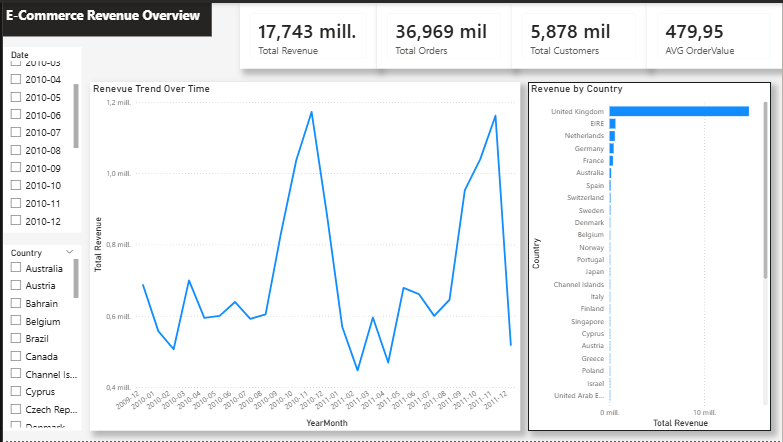
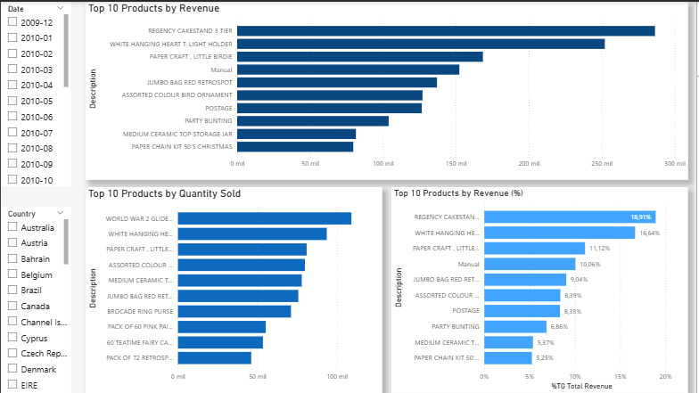
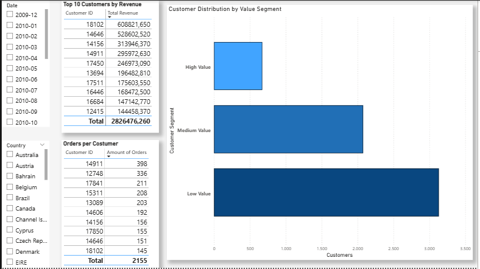

# E-commerce Sales & Customer Analysis Dashboard

## Overview
This project analyzes over 36,000 e-commerce transactions to uncover key business insights related to sales performance, product trends, and customer behavior.

The dashboard was built using Power BI to help identify revenue drivers, evaluate product performance, and segment customers based on their contribution to total revenue.

## Business Objectives
- Analyze revenue trends over time
- Identify top-performing products
- Compare high-volume vs high-revenue products
- Understand customer purchasing behavior
- Segment customers by revenue contribution
- Support data-driven business decisions

## Tools & Technologies
- Microsoft Power BI
- Power Query
- DAX
- Data Modeling
- Data Visualization

## Dashboard Pages

### 1. Revenue Overview
Provides a high-level overview of business performance, including:
- Total Revenue
- Total Orders
- Total Customers
- Average Order Value
- Revenue trends over time
- Revenue by country

### 2. Sales Analysis
Focuses on product performance through:
- Top 10 products by revenue
- Top 10 products by quantity sold
- Revenue share analysis of top-performing products

### 3. Customer Analysis
Analyzes customer behavior and segmentation:
- Top customers by revenue
- Orders per customer
- Customer segmentation (High, Medium, Low Value)

## Key Insights
- A small number of products contributes a significant share of total revenue
- High-value customers represent a small segment but generate a large portion of revenue
- Most customers belong to the low-value segment
- Some products sell in high volume but contribute less revenue overall

## Dashboard Preview

### Overview

### Sales Analysis

### Customer Analysis

## Dataset
Online Retail Dataset containing transactional e-commerce data between 2009 and 2011.

## Author
Joshua Ruiz

Aspiring Data Analyst passionate about transforming raw data into actionable business insights through data visualization and analytics.
